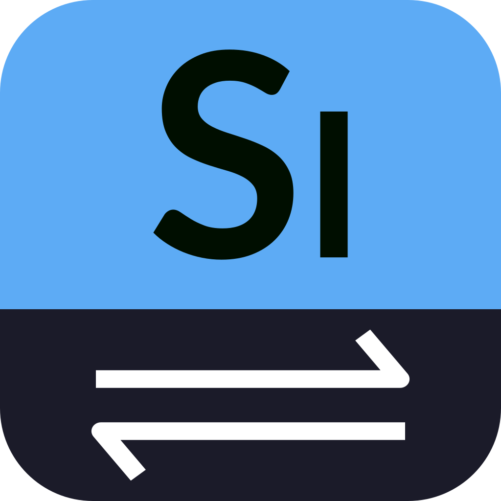

    

<h1 align="center">
    Sidex
</h1>
<h4 align="center">
    Simplifies data exchange across your entire stack.
</h4>

  
  
  
  

> 🚧 **WORK IN PROGRESS** 🚧
>
> Sidex **is still under construction**. In particular, the functionality described here may not exist yet, may change considerably in the future, or may even be completely abandoned at a later point in time. We are actively working on the design, features, and vision of Sidex. ⚠️

_Sidex_ is a format- and language-agnostic data modeling and API definition framework with a focus on simplicity, extensibility, and developer ergonomics. Sidex aims to simplify data exchange between different programming languages and platforms via potentially multiple interchange formats and storage backends.

💡 **Idea:** The idea is simple, define your data model and API once with Sidex and then generate code for different languages, interchange formats, and storage backends from this single Sidex ground truth.

Sidex's type system and definition language have been inspired by [Rust](https://www.rust-lang.org/). With _custom attributes_, similar to [Rust's attributes](https://doc.rust-lang.org/reference/attributes.html), the possibilities for code generation become almost limitless. You can easily develop your own code generator or extend an existing one to fit your needs (e.g., for generating additional methods).

To learn more, [checkout Sidex's website](https://oss.silitics.com/sidex/). 🚀

## ✨ Features

- **Schema-first** definition of data structures and APIs.
- Designed for **format- and language-agnostic** definitions.
- Modern **algebraic data types** and **non-null** by default.
- **Extensible** with user-defined opaque types.
- Support for **generics**, **recursive types**, and **custom attributes**.
- Language server and [VS Code extension](https://marketplace.visualstudio.com/items?itemName=silitics.sidex) for increased productivity.
- Out-of-the-box support for [Rust](https://rust-lang.org), [TypeScript](https://www.typescriptlang.org), and [JSON](https://www.ecma-international.org/publications-and-standards/standards/ecma-404/).

## ⚖️ Licensing

Sidex is licensed under either [MIT](https://github.com/silitics/sidex/blob/main/LICENSE-MIT) or [Apache 2.0](https://github.com/silitics/sidex/blob/main/LICENSE-APACHE) at your opinion.

Unless you explicitly state otherwise, any contribution intentionally submitted for inclusion in this project by you, as defined in the Apache 2.0 license, shall be dual licensed as above, without any additional terms or conditions.

---

Made with ❤️ by [Silitics](https://www.silitics.com).
